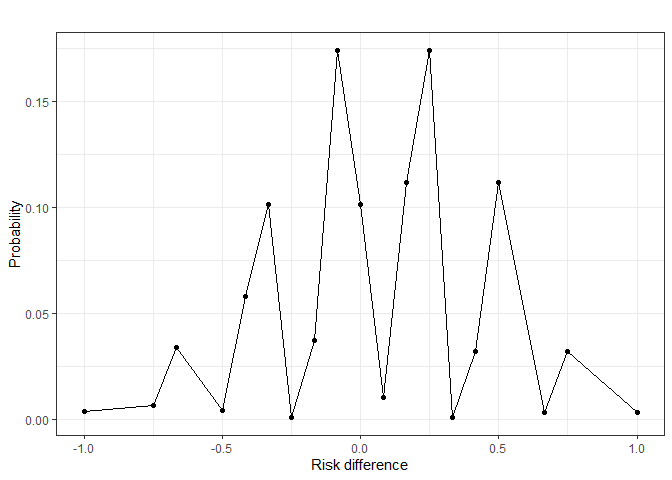
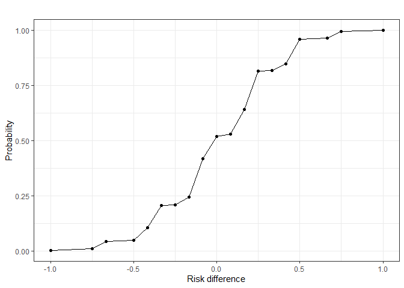

# riskdiff

Risk differences are frequently used to compare two treatment groups
with respect to a binary endpoint in clinical trials. This implies the
comparison of two underlying binomial distributions. As opposed to the
sum of two (independent) binomial distributions, the difference between
two binomial distributions does not generally follow a binomial
distribution. Oftentimes, a normal approximation is used for the risk
difference, which may be inappropriate for small sample sizes.
Furthermore, formulating rejection regions based on the normal
approximation insinuates that the risk difference follows a continuous
distribution, while for a specific trial scenario, it is a discrete
random variable. The `riskdiff` package aims to provide insights into
the exact distribution for risk differences. All calculations are based
on the observation that the risk difference of a specific trial has a
finite number of possible outcomes, for each of which a corresponding
probability can be calculated.

## Installation

You can install the development version of riskdiff from
[GitHub](https://github.com/) with:

``` r

# install.packages("devtools")
devtools::install_github("morten-dreher/riskdiff")
```

## Example

Presume we are interested in increasing the occurrence of a binary
outcome (e.g., disease remission). For this example, we use very small
sample sizes to keep the output brief. We make the assumptions:
remission rate in treatment group $`\pi_T = 0.3`$, remission rate in
control group $`\pi_C = 0.25`$, sample size of treatment group
$`n_T = 4`$ and sample size of control group $`n_C = 3`$.

``` r

library(riskdiff)

# First, fix a trial scenario ----

## Assumed outcome probabilities ----
piTreatment <- 0.3
piControl <- 0.25

## Assumed group sizes ----
nTreatment <- 4
nControl <- 3
```

Now, we can calculate the density of the risk difference distribution
using [`driskdiff()`](reference/driskdiff.md).

``` r

# Calculate
riskdiff_density <- riskdiff::driskdiff(
  piTreatment = piTreatment,
  piControl = piControl,
  nTreatment = nTreatment,
  nControl = nControl
)

# Tease results
head(riskdiff_density)
#>   Risk difference Probability
#> 1      -1.0000000 0.003751563
#> 2      -0.7500000 0.006431250
#> 3      -0.6666667 0.033764062
#> 4      -0.5000000 0.004134375
#> 5      -0.4166667 0.057881250
#> 6      -0.3333333 0.101292187
```

The output of [`driskdiff()`](reference/driskdiff.md) is a `data.frame`
with the two columns Risk difference and Probability, the former
representing the value of the risk difference and the latter its
probability of occurring given the trial setting. Note that the possible
risk differences only depend on the group sizes, not the individual
success probabilities of the groups.

The density can be plotted by providing `riskdiff_density` to
[`plotriskdiff()`](reference/plotriskdiff.md):

``` r

riskdiff_density |> plotriskdiff()
```



As an analogue to [`driskdiff()`](reference/driskdiff.md), the function
[`priskdiff()`](reference/priskdiff.md) is available for the cumulative
probability function with the same syntax:

``` r

riskdiff::priskdiff(
  piTreatment = piTreatment,
  piControl = piControl,
  nTreatment = nTreatment,
  nControl = nControl
) |> riskdiff::plotriskdiff()
```



Both plots hint at a very sporadic and oddly shaped distribution of the
risk difference.

Further discussion on these results and an intuitive justification of
the approach implemented in `riskdiff` is provided in the package
vignettes.
