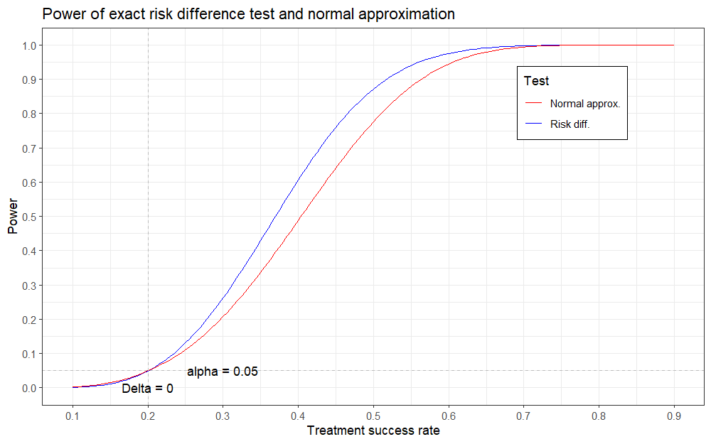
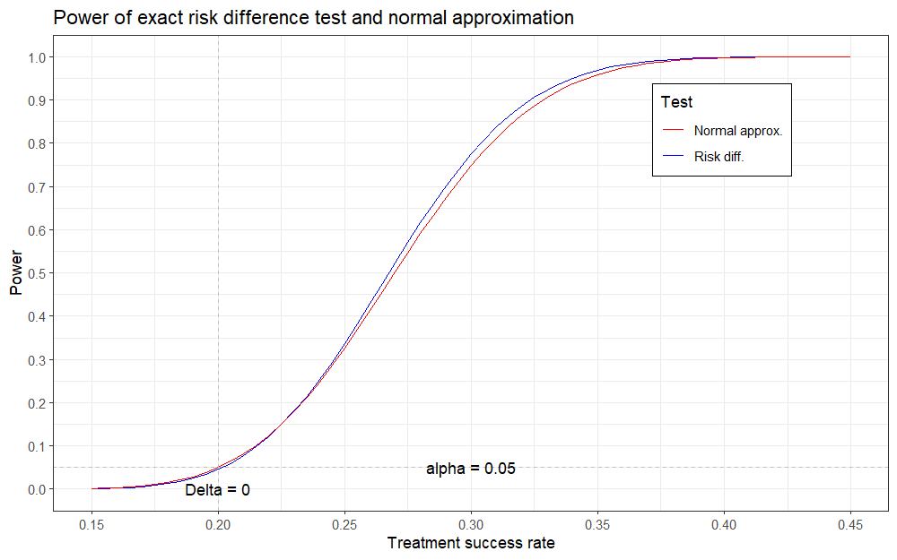

```{r, include = FALSE}
knitr::opts_chunk$set(
  collapse = TRUE,
  comment = "#>",
  fig.dim = c(8,5)
)
```

# Introduction

This document provides a brief introduction to discrete risk differences and to the R package `riskdiff`.
First, load the package:

```{r setup, eval = FALSE}
library(riskdiff)
```

# Exact risk differences

Presume that we perform a clinical trial with two groups and a binary endpoint. 
This means the comparison of the two rates $\pi_t$ of the treatment group and $\pi_c$ of the control group.
For illustration purposes, let $\pi_t$ and $\pi_c$ simply describe the rates of "treatment success" in the treatment and control group, respectively.
In other words, the treatment with the higher rate is the favourable one for our example and we could formulate a null hypothesis as $H_0: \pi_t \leq \pi_c$.
For large enough sample sizes $n_t$, $n_c$ of treatment and control group, we may use a normal approximation to answer the research question.
However, for very small sample sizes, the approximation may be inadequate and one may be interested in exact results.
The `riskdiff` package concerns itself with the (exact) distribution of risk differences and therefore, these will be described in detail here.
Note that we can rewrite the above null hypothesis as $H_0: \pi_t \leq \pi_c \Leftrightarrow \Delta_\pi:= \pi_t - \pi_c \leq 0$, where $\Delta_\pi$ denotes the risk difference.

While the risk difference is to be thought of as a real-valued number between 1 and -1, since it is simply defined by subtracting two rates, the risk difference observed in a clinical trial is in actuality a discrete random variable with a finite support.
To illustrate this, presume that we perform an experiment with 4 patients in the treatment group and 3 patients in the control group (we note that such a trial will most likely not lead to significant results, but only serves for illustration purposes here).

For independent patients and groups, we can describe the number of successes in each group using binomially distributed random variables $X_i$, where $i\in\{t,c\}$ denotes the respective group.
Thus, $X_t \sim Bin(4, \pi_t)$ and $X_c\sim Bin(3, \pi_c)$ describe the number of successes in the treatment and control group, respectively.

In both groups, the number of successes which we can observe is clearly finite (0, 1, 2, 3, 4 successes in the treatment group and 0, 1, 2, 3 successes in the control group), meaning the observed success rates are a discrete quantity (0/4, 1/4, 2/4, 3/4, 4/4 in the treatment group and 0/3, 1/3, 2/3, 3/3 in the control group). 
Since the observed risk difference is just the difference of these discrete success rates, it is also a discrete quantity.
The possible values it can take can be visualised in a table:

&nbsp; | 0/4 | 1/4 | 2/4 | 3/4 | 4/4
-- | -- | -- | -- | -- | --
**0/3** | 0/12 | 3/12 | 6/12 | 9/12 | 12/12
**1/3** | -4/12 | -1/12 | 2/12 | 5/12 | 8/12
**2/3** | -8/12 | -5/12 | -2/12 | 1/12 | 4/12
**3/3** | -12/12 | -9/12 | -6/12 | -3/12 | 0/12

Each table entry is taken by subtracting the number of successes in the control group (displayed by the row names) from the number of successes in the treatment group (displayed by the column names).
For ease of presentation, the common denominator 12 is used for all entries.

From the table, two things become apparent:
 1) Not every value can be reached (e.g., a risk difference of 11/12 is not possible with the given sample sizes).
 2) Some values may occur more than once. For example, a risk difference of 0/12 can occur either if all patients experience a treatment success or if all patients experience a treatment failure. This phenomenon always occurs for a risk difference of 0, regardless of the sample sizes, and may also occur for other risk differences, if the group sizes are not coprime (consider group sizes 8 and 4, where a risk difference of 8/32 can be reached via 8/8 and 3/4 successes, 6/8 and 2/4 successes, 4/8 and 1/4 successes as well as 2/8 and 0/4 successes).

Since the two groups and the patients within them are assumed to be independent, the probability of each risk difference in the table occurring is simply calculated by multiplying the marginal probabilities.
Assuming the success probabilities $\pi_t = 0.6$ and $\pi_c=0.3$, the calculation of the probabilities is straightforward.
For example, the probability of the observed risk difference being 12/12 is simply the probability of observing 4 successes in the treatment group times the probability of observing 0 successes in the control group:

$$
P(\Delta_\pi = 12/12) = P(X_t=4) \cdot P(X_c=0) = \binom{4}{4}0.6^4\cdot \binom{3}{0}(1-0.3)^3 = 0.0445.
$$

Completing the table yields the probabilities:


&nbsp; | 0/4 | 1/4 | 2/4 | 3/4 | 4/4
-- | -- | -- | -- | -- | --
**0/3** | 0.0088 | 0.0527 | 0.1185 | 0.1185 | 0.0445
**1/3** | 0.0113 | 0.0677 | 0.1524 | 0.1524 | 0.0572
**2/3** | 0.0048 | 0.0290 | 0.0653 | 0.0653 | 0.0245
**3/3** | 0.0007 | 0.0041 | 0.0093 | 0.0093 | 0.0035

Alternatively, we could calculate a scenario under our aforementioned null hypothesis, e.g. for equal success rates $\pi_t = \pi_c = 0.3$, equating to a risk difference $\Delta_\pi=0$.

This yields the probability table:

&nbsp; | 0/4 | 1/4 | 2/4 | 3/4 | 4/4
-- | -- | -- | -- | -- | --
**0/3** | 0.0824 | 0.1412 | 0.0908 | 0.0259 | 0.0028
**1/3** | 0.1059 | 0.1815 | 0.1167 | 0.0333 | 0.0036
**2/3** | 0.0454 | 0.0778 | 0.0500 | 0.0143 | 0.0015
**3/3** | 0.0065 | 0.0111 | 0.0071 | 0.0020 | 0.0002


We may summarise and order these probabilities by their risk differences.
When summarising, we must keep in mind that, as mentioned above, a risk difference of 0 can be reached by two combinations (all successes or all failures).
Accordingly, we must sum up both probabilities for the overall probability of a risk difference of 0.
However, note the vast differences of these probabilities: the probability of all failures is $0.0824$, whereas the probability of all successes is merely $0.0002$. 
It may be questionable to treat these situations in the same way.
Regardless, this is a feature that occurs when reducing the complexity of the investigated hypothesis from two dimensions ($\pi_t$ and $\pi_c$) to one dimension ($\Delta_\pi$).

Risk difference | Probability
-- | -- | -- 
-12/12 | 0.0065
-9/12 | 0.0111
-8/12 | 0.0454
-6/12 | 0.0071
-5/12 | 0.0778 
-4/12 | 0.1059  
-3/12 | 0.0020
-2/12 | 0.0500 
-1/12 | 0.1815
0/12 | 0.0826   
1/12 | 0.0142 
2/12 | 0.1167 
3/12 | 0.1412 
4/12 | 0.0015  
5/12 | 0.0333 
6/12 | 0.0908 
8/12 | 0.0036 
9/12 | 0.0259
12/12 | 0.0028 


Plotting the individual probabilities against the risk difference yields an interesting picture:

```{r plot_driskdiffs, fig.dim=c(8, 5)}
rds <- c(c(12, 9, 8, 6, 5, 4, 3, 2, 1)/(-12), c(0, 1, 2, 3, 4, 5, 6, 8, 9, 12)/12)
probs <- c(0.0065,0.0111, 0.0454, 0.0071, 0.0778, 0.1059, 0.0020, 0.0500, 
           0.1815, 0.0826, 0.0142, 0.1167, 0.1412, 0.0015, 0.0333, 0.0908, 
           0.0036, 0.0259, 0.0028)

plot(rds, probs, xlab = "Risk difference", ylab = "Probability", 
     main = "Risk difference distribution under H0")
lines(rds, probs)
```

Clearly, the distribution of the risk difference is not symmetric around 0 under $H_0$.
Furthermore, the probability of observing a risk difference of 0 is rather low, compared to other values in the vicinity.
The reasoning for this is intuitive, as for the given example of coprime sample sizes, a risk difference of 0 will only be achieved if a treatment success is observed for all patients in the trial or if a treatment failure is observed for all patients in the trial.
With the assumed moderate success probability of $0.3$, neither of these events is overwhelmingly likely.

Under $H_0$, the most likely risk difference to be observed is -1/12, with a probability of $0.1815$.
We may also investigate the cumulative risk difference distribution under $H_0$ by simply using the cumulative sum of the probabilities:

```{r plot_priskdiffs, fig.dim = c(8, 5)}
cumProbs <- cumsum(probs)

plot(rds, cumProbs, xlab = "Risk difference", ylab = "Cumulative Probability", 
     main = "Cumulative risk difference distribution under H0")
lines(rds, cumProbs)
abline(h = cumProbs[10], col = "red", lty = 2)
abline(v = 0, col = "red", lty = 2)
abline(h = 0.95, col = "blue", lty = 2)
```

As illustrated by the red lines, the risk difference 0 clearly does not constitute the centre of the distribution, as the probability to observe a risk difference of at most 0 exceeds 0.5, which would be expected for a symmetric distribution.

```{r output_priskdiffs}
rds[10]
cumProbs[10]
```

We may design a simple (one-sided) level $\alpha$ statistical test for this situation by rejecting $H_0$ for risk differences with a cumulative probability that exceeds $1-\alpha$.
We use $\alpha=0.05$ for illustration.
Note that for the comparison, we must subtract the concrete probabilities of achieving the specific risk difference to maintain the $\alpha$ level.
In the plot above, the blue horizontal line indicates the cumulative probability of 0.95.

```{r rejection_tIe_1}
alpha <- 0.05
rejectData <- data.frame(riskDifference = rds, cumulativeProbability = cumProbs,
                         probGeq = 1 - cumProbs + probs,
                         reject = 1 - cumProbs + probs < alpha)
rejectData
```

In the data frame above, the column `probGeq` indicates the probability of achieving a risk difference greater or equal than the respective value.
For a valid (discrete) $\alpha$ level test, we may only reject risk differences for which this probability is less than $\alpha$.
Using $\alpha = 0.05$, $H_0$ can be rejected for risk differences of 0.66 or greater.
The true type I error rate of this test is thus $0.0324$ and the resulting test will be conservative, which is not surprising given its discrete nature.

We may simulate:

```{r simulation_tIe_1}
nSims <- 1000000

successTreatment <- rbinom(nSims, 4, 0.3)
successControl <- rbinom(nSims, 3, 0.3)

riskDifferences <- successTreatment/4 - successControl/3

reject <- riskDifferences > 0.5

mean(reject)
```

The simulated and theoretical type I error rates are in good agreement.

We will now attempt a power calculation and simulation for the same group sizes, but assuming the event rates $\pi_t = 0.6$ and $\pi_c = 0.3$.
The `priskdiff()` and `driskdiff()` functions from the `riskdiff` facilitate the calculation and `plotriskdiff()` visualises the result:

```{r plot_priskdiff_power, fig.dim = c(8,5)}
probs <- riskdiff::driskdiff(nTreatment = 4, nControl = 3, piTreatment = 0.6, piControl = 0.3)
cumProbs <- riskdiff::priskdiff(nTreatment = 4, nControl = 3, piTreatment = 0.6, piControl = 0.3)
cumProbs
riskdiff::plotriskdiff(cumProbs)
```

From above, we learned that our test rejects for risk differences of 0.66 or greater (or identically for risk differences truly greater than 0.5).
We will generally use the "truly greater than" rejection rule rather than the "greater or equal" rule to avoid possible numerical inaccuracies.
We may now calculate the power of our test for this situation:

```{r rejection_power_1}
rejectData <- cbind(cumProbs, probGeq = 1 - cumProbs[,2] + probs[,2])
rejectData
```

According to this calculation, the probability of reaching or exceeding a risk difference of 0.66 is 0.22, which is the power in this scenario.

We may simulate:

```{r simulation_power_1}
successTreatment <- rbinom(nSims, 4, 0.6)
successControl <- rbinom(nSims, 3, 0.3)

riskDifferences <- successTreatment/4 - successControl/3

reject <- riskDifferences > 0.5

mean(reject)
```

Again, the simulated and theoretical power rates are almost identical.

We shall now move on to a more realistic trial scenario.

# Departure from tiny sample sizes

In the previous example, we used very small sample sizes of 4 and 3 patients in the treatment and control group, respectively.
Apart from very early phase testing (in which the focus usually does not lie upon achieving statistical significance), such trial sizes are uncommon in practice.

Let us instead focus on a trial with slightly larger, but still relatively small sample sizes.
In a rare disease setting, we may consider a trial with 38 patients in the treatment group and 23 patients in the control group.
The imbalance between the treatment groups does lower the statistical power, but may not be uncommon in rare diseases in order to improve recruitment.
We will assume a control rate of $\pi_c = 0.2$ and use the null hypothesis $H_0: \Delta_\pi \leq 0$.

Calculating the distribution of the risk difference under $H_0$ is more computationally challenging now, since there are far more possible risk differences:

```{r plot_priskdiff_2}
probs <- riskdiff::driskdiff(nTreatment = 38, nControl = 23, piTreatment = 0.2, piControl = 0.2)
riskdiff::plotriskdiff(probs)

cumProbs <- riskdiff::priskdiff(nTreatment = 38, nControl = 23, piTreatment = 0.2, piControl = 0.2)
riskdiff::plotriskdiff(cumProbs)
```

The risk difference plots are now messier, but hint at a roughly symmetric distribution around 0.
Formulating a statistical test can be done in the same manner as before:

```{r rejection_tIe_2}
rejectData <- cbind("Risk difference" = cumProbs[,1], 
                    "Cumulative probability" = cumProbs[,2],
                    probGeq = 1 - cumProbs[,2] + probs[,2],
                    reject = 1 - cumProbs[, 2] + probs[,2] < alpha)
# Save for later
rejectionRegion <- rejectData[, 4]
rejectData[605:610, ]
```

For this setting, we may reject risk differences of 0.1693 or greater at a level of $\alpha = 0.05$.
The true type I error rate of this test is $0.0493$, which is much closer to the nominal level $\alpha = 0.05$.

We may again simulate the type I error rate of this trial:

```{r, simulation_tIe_2}
successTreatment <- rbinom(nSims, 38, 0.2)
successControl <- rbinom(nSims, 23, 0.2)

riskDifferences <- successTreatment/38 - successControl/23
reject <- riskDifferences > rejectData[607, 1]

mean(reject)
```

The simulated and theoretical type I error rates are in good agreement.

For a power simulation, we will consider the point alternative $\pi_t = 0.4$ and $\pi_c = 0.2$:

```{r rejection_power_2}
probs <- riskdiff::driskdiff(nTreatment = 38, nControl = 23, piTreatment = 0.4, piControl = 0.2)
cumProbs <- riskdiff::priskdiff(nTreatment = 38, nControl = 23, piTreatment = 0.4, piControl = 0.2)

# Power calculation
rejectData <- cbind("Risk difference" = cumProbs[,1], 
                    "Cumulative probability" = cumProbs[,2],
                    probGeq = 1 - cumProbs[,2] + probs[,2], 
                    "reject" = rejectionRegion)

rejectData[605:610, ]
```

The theoretical power for this test given the scenario is 0.606.

We simulate:

```{r simulation_power_2}
successTreatment <- rbinom(nSims, 38, 0.4)
successControl <- rbinom(nSims, 23, 0.2)

riskDifferences <- successTreatment/38 - successControl/23
reject <- riskDifferences > rejectData[607, 1]

mean(reject)
```

Again, the simulated power is almost identical to the theoretical power.

An interesting (yet suspicious) observation is that this power is remarkably larger than the one achieved by working with a normal approximation, for example the one implemented in the `rpact` package:

```{r calculation_normal_2}
powerRates <- rpact::getPowerRates(
  pi1 = 0.4, pi2 = 0.2, maxNumberOfSubjects = 38+23, allocationRatioPlanned = 38/23,
  alpha = 0.05
)

summary(powerRates)
```

Perhaps this stems from an inaccuracy of the normal approximation in this case, as especially the control group has a small sample size and small event rate.

We may compare the two tests for different treatment success rates:
```{r comparison_2, cache = TRUE, eval = FALSE}
piTreatment <- seq(0.1, 0.9, 0.005)
powerERD <- numeric(length(piTreatment))

for(i in 1:length(piTreatment)) {
  probs <- riskdiff::driskdiff(nTreatment = 38, nControl = 23, piTreatment = piTreatment[i], piControl = 0.2)
  cumProbs <- riskdiff::priskdiff(nTreatment = 38, nControl = 23, piTreatment = piTreatment[i], piControl = 0.2)
  
  rejectData <- cbind("Risk difference" = cumProbs[,1], 
                      "Cumulative probability" = cumProbs[,2],
                      probGeq = 1 - cumProbs[,2] + probs[,2], 
                      "reject" = rejectionRegion)
  
  powerERD[i] <- rejectData[608, 3]
}

powerRpact <- rpact::getPowerRates(
  pi1 = piTreatment, pi2 = 0.2, maxNumberOfSubjects = 38+23, 
  allocationRatioPlanned = 38/23, alpha = 0.05
)$overallReject
```

The above code is time-consuming and thus executed elsewhere.
A plot visualising the results is shown below:

```{r plot_comparison_2, width.out = "70%"}

```

For moderately large effect sizes (treatment success rates approx 0.3 - 0.6), the exact risk difference test offers a larger power than the normal approximation.
Although barely visible in the plot, the exact risk difference test is slightly more conservative than the normal approximation for small effect sizes due to its discrete nature.
In contrast to the normal approximation, this means that the "true" $\alpha$ level of the exact risk difference test depends on the sample sizes and may be considerably smaller than the nominal level.
For large effect sizes (treatment success rates > 0.65), the power difference between the two tests becomes negligible.

# Arrival at larger sample sizes

When entering the territory of large sample sizes, the normal approximation becomes more accurate.
Consider a trial with 200 patients each in the treatment and control group and event rates of 0.2 under $H_0$.
To compare the performances of the normal approximation and exact risk difference test, we can identify the rejection region of the exact risk difference test similar to above:

```{r calculation_3}
probs <- riskdiff::driskdiff(nTreatment = 200, nControl = 200, piTreatment = 0.2, piControl = 0.2)
cumProbs <- riskdiff::priskdiff(nTreatment = 200, nControl = 200, piTreatment = 0.2, piControl = 0.2)
```

The exact risk difference test at $\alpha = 0.05$ proposes the following rejection region:

```{r rejection_tIe_3}
rejectData <- cbind("Risk difference" = cumProbs[,1], 
                    "Cumulative probability" = cumProbs[,2],
                    probGeq = 1 - cumProbs[,2] + probs[,2],
                    reject = 1 - cumProbs[, 2] + probs[,2] < alpha)
# Save for later
rejectionRegion <- rejectData[, 4]

rejectData[213:217,]
```

For the given sample sizes, a risk difference of 0.07 or greater warrants a rejection of $H_0$.
Power calculation for the point alternative $\pi_t = 0.4$ and $\pi_c = 0.2$ yields:

```{r rejection_power_3}
probs <- riskdiff::driskdiff(nTreatment = 200, nControl = 200, piTreatment = 0.4, piControl = 0.2)
cumProbs <- riskdiff::priskdiff(nTreatment = 200, nControl = 200, piTreatment = 0.4, piControl = 0.2)

rejectData <- cbind("Risk difference" = cumProbs[,1], 
                    "Cumulative probability" = cumProbs[,2],
                    probGeq = 1 - cumProbs[,2] + probs[,2], 
                    "reject" = rejectionRegion)
rejectData[c(213:217, length(rejectData[,1])),]
```

Comparing to the normal approximation:
```{r calculation_normal_3}
rpact::getPowerRates(
  pi1 = 0.4, pi2 = 0.2, maxNumberOfSubjects = 200+200, 
  allocationRatioPlanned = 1, alpha = 0.05
) |> summary()
```

Comparing the two tests in this setting, the exact risk difference test delivers a marginally larger power, however, this is not relevant for any practical purposes. 
Notably, the efficacy boundary on the treatment scale of the `rpact` output is identical to the one proposed by the exact risk difference test.


Using a slightly smaller alternative effect size of $\pi_t = 0.3$ and $\pi_c = 0.2$:

```{r rejection_power_4}
probs <- riskdiff::driskdiff(nTreatment = 200, nControl = 200, piTreatment = 0.3, piControl = 0.2)
cumProbs <- riskdiff::priskdiff(nTreatment = 200, nControl = 200, piTreatment = 0.3, piControl = 0.2)

rejectData <- cbind("Risk difference" = cumProbs[,1], 
                    "Cumulative probability" = cumProbs[,2],
                    probGeq = 1 - cumProbs[,2] + probs[,2], 
                    "reject" = rejectionRegion)
rejectData[213:217,]
```

Comparing to the normal approximation:
```{r calculation_normal_4}
rpact::getPowerRates(
  pi1 = 0.3, pi2 = 0.2, maxNumberOfSubjects = 200+200, 
  allocationRatioPlanned = 1, alpha = 0.05
) |> summary()
```

In this case, the additional power that the exact risk difference provides is already considerable.
Moving to an even smaller effect size of $\pi_t = 0.25$ and $\pi_c = 0.2$:

```{r rejection_power_5}
probs <- riskdiff::driskdiff(nTreatment = 200, nControl = 200, piTreatment = 0.25, piControl = 0.2)
cumProbs <- riskdiff::priskdiff(nTreatment = 200, nControl = 200, piTreatment = 0.25, piControl = 0.2)

rejectData <- cbind("Risk difference" = cumProbs[,1], 
                    "Cumulative probability" = cumProbs[,2],
                    probGeq = 1 - cumProbs[,2] + probs[,2], 
                    "reject" = rejectionRegion)

rejectData[213:217,]
```

Comparing to the normal approximation:

```{r calculation_normal_5}
rpact::getPowerRates(
  pi1 = 0.25, pi2 = 0.2, maxNumberOfSubjects = 200+200, 
  allocationRatioPlanned = 1, alpha = 0.05
) |> summary()
```

The power difference is now less pronounced, but still favours the exact risk difference test.

Comparing the power of the exact risk difference test and the normal approximation for different treatment success rates:

```{r plot_comparison_5, width.out = "70%"}

```


We note that for small treatment effect differences that are close to or part of the null hypothesis, the exact risk difference offers a slightly smaller power than the normal approximation.
However, this is to be expected, as the normal approximation can always exhaust the full alpha level, where as the exact risk difference test is slightly overconservative in these cases.
For larger effect sizes, the exact risk difference test offers a larger power than the normal approximation, but these gains in power are fairly small.

# Extreme conditioning - large and small rates

The normal approximation is usually only accurate for moderate success rates (unless the sample sizes are extraordinarily large).
To test the performance of the exact risk difference test under extreme conditions, we presume that, for the trial with 200 patients per group, the event rate in the control group is now $\pi_c = 0.01$.

We achieve the rejection region as above:

```{r}
probs <- riskdiff::driskdiff(nTreatment = 200, nControl = 200, piTreatment = 0.01, piControl = 0.01)
cumProbs <- riskdiff::priskdiff(nTreatment = 200, nControl = 200, piTreatment = 0.01, piControl = 0.01)

rejectData <- cbind("Risk difference" = cumProbs[,1], 
                    "Cumulative probability" = cumProbs[,2],
                    probGeq = 1 - cumProbs[,2] + probs[,2], 
                    "reject" = 1-cumProbs[, 2] + probs[,2] < alpha)

rejectionRegion <- rejectData[, 4]

# rejectData <- cbind(rejectData,
                    # "reachToReject" = c(0, diff(rejectionRegion)),
                    # "exceedToReject" = c(diff(rejectionRegion), 0))
rejectData[202:207,]
```

Calculating the corresponding power for success rates of $\pi_t = 0.03$ and $\pi_c = 0.01$:

```{r}
probs <- riskdiff::driskdiff(nTreatment = 200, nControl = 200, piTreatment = 0.03, piControl = 0.01)
cumProbs <- riskdiff::priskdiff(nTreatment = 200, nControl = 200, piTreatment = 0.03, piControl = 0.01)

rejectData <- cbind("Risk difference" = cumProbs[,1], 
                    "Cumulative probability" = cumProbs[,2],
                    probGeq = 1 - cumProbs[,2] + probs[,2], 
                    "reject" = rejectionRegion)

rejectData[202:207,]
```

We get a decent power of 0.56 for the exact risk difference test despite the small success rates.

Comparing this to the normal approximation:

```{r}
rpact::getPowerRates(
  pi1 = 0.03, pi2 = 0.01, maxNumberOfSubjects = 200+200, 
  allocationRatioPlanned = 1, alpha = 0.05
) |> summary()
```

The power improvement gained by the exact risk difference test as compared to the normal approximation is substantial.
However, the normal approximation may not be a solid choice here anyway.
